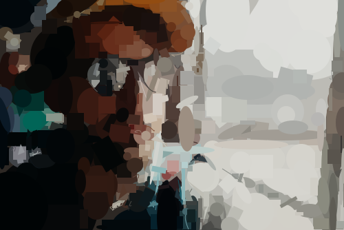

# Cutout Remastered
> render a raster image to svg

This library renders raster images to SVG images. 
The algorithm repeatedly generates and mutates shapes, keeping only those that closely match the original bitmap. 

The code has largely been ported from the [last known good fork of cutout](https://github.com/piwodlaiwo/cutout) which itself is derived from [Primitive](https://github.com/fogleman/primitive).

As per original, this has
- No native, non-javascript dependencies (so no node-canvas, as that relies on Cairo)
- No browser specific APIs (even though it can be bundled for the browser without any problems)
- Modular and not tied to a single implementation, so it can fit in any project

New features
- Ported to Typescript.
- Replaced d3 randomNormal with a [faster random algorithm (gpick 0.0)](https://strainer.github.io/Fdrandom.js/) for shape generation that has a greater central bell curve (anecdotally better fitting in fewer iterations).
- Fixed a race condition causing NaNs in randomNormal only seen after a 5K+ iterations caused by a bug in the original d3 randomNormal implementation.
- Replaced missing "dainty" utility lib npm dependency with a small function to do the same thing (thanks go to [swanie21's](https://github.com/swanie21) svg info page [svg-shapes](https://github.com/swanie21/svg-shapes) for the crash course).
- Provided a direct node runner.ts to use with your own images via [Jimp](https://github.com/jimp-dev/jimp) (original requires direct ndarrays or using cutout-cli which is now unavailable).
- Added [open licenced pexels.com](https://www.pexels.com/license/) example images. 
- Cleaned up/modernised the code (an ongoing thing).

Additionally, I'm investigating further performance improvements using webworkers to split the variants work over multiple threads.

## Examples with Increasing Detail

| Raster input                                  | Svg result                                    |
|:----------------------------------------------|:----------------------------------------------|
|     |     |
|  |  |
|        |        |

# Usage
Note that this is only a quickly created script with a hardcoded config for my own testing but felt it would be useful for others to try it out before using the API.

## Usage with ts-node

```
ts-node runner.ts images/robot.png ./robot.svg
```
## Usage with transpile and node

```
npm run clean
npm run build
node ./dist/runner.js images/robot.png ./robot.svg
```

## API

### new Cutout(target, [options])

| Param | Type | Default | Description |
| --- | --- | --- | --- |
| target | <code>ndarray</code> |  | The image to render to svg |
| [options] | <code>Object</code> |  | Configuration options |
| [options.alpha] | <code>number</code> | <code>255</code> | The opacity of the shapes (0-255) |
| [options.background] | <code>Array.&lt;number&gt;</code> |  | Optional background color, expressed as an array of four numbers between 0 - 255 for respectively red, green, blue and transparency |
| [options.shapeTypes] | <code>Array.&lt;string&gt;</code> |  | The types of shapes to use when generating the image, available are: `Circle`, `Cubic`, `RotatedEllipse`, `Ellipse`, `Line`, `Quadratic`, `Rect`, `RotatedRect`, `Square` and `Triangle` |
| [options.amountOfShapes] | <code>number</code> | <code>1000</code> | The number of shapes to try per step |
| [options.amountOfAttempts] | <code>number</code> | <code>100</code> | The number of times to mutate each candidate shape |

<a name="Cutout+image"></a>

### cutout.image ⇒ <code>ndarray</code>
Get the current image

**Kind**: instance property of [<code>Cutout</code>](#Cutout)
**Returns**: <code>ndarray</code> - The current image
<a name="Cutout+svg"></a>

### cutout.svg ⇒ <code>string</code>
Get the current svg

**Kind**: instance property of [<code>Cutout</code>](#Cutout)
**Returns**: <code>string</code> - The current svg
<a name="Cutout+difference"></a>

### cutout.difference ⇒ <code>number</code>
Get the current difference

**Kind**: instance property of [<code>Cutout</code>](#Cutout)
**Returns**: <code>number</code> - The current difference
<a name="Cutout+step"></a>

### cutout.step() ⇒ <code>this</code>
Add a single new shape

**Kind**: instance method of [<code>Cutout</code>](#Cutout)
**Returns**: <code>this</code> - The class instance

## Credits

- [Primitive](https://github.com/fogleman/primitive)
- [Primitive.js](https://github.com/ondras/primitive.js)
- [Geometrize](https://github.com/Tw1ddle/geometrize-haxe)
- [Ismay](https://github.com/ismay) for the original implementation.
- [Piwodlaiwo](https://github.com/piwodlaiwo) for retaining a fork of the original. 

## License

[MIT](http://mit-license.org/)

[build-badge]: https://travis-ci.org/ismay/cutout.svg?branch=master
[build-url]: https://travis-ci.org/ismay/cutout
[greenkeeper-badge]: https://badges.greenkeeper.io/ismay/cutout.svg
[greenkeeper-url]: https://greenkeeper.io/
[coverage-badge]: https://coveralls.io/repos/github/ismay/cutout/badge.svg?branch=master
[coverage-url]: https://coveralls.io/github/ismay/cutout?branch=master
